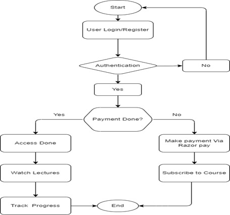

# EduHive - A Mobile eLearning App for Interactive and Accessible Student Learning


## 1. Title of the Project
EduHive - A Mobile eLearning App for Interactive and Accessible Student Learning

## 2. Abstract
Traditional education systems have long depended on in-person classroom sessions, making learning opportunities limited for many due to geographical, economic, or time-related barriers. To resolve these challenges, this project introduces a mobile-first smart learning application developed with React Native, Expo, and MongoDB. The platform is helpful for today’s learners by delivering engaging, on-the-go, and personalized educational experiences. It acts as a bridge between conventional education systems and the adaptability offered by modern digital learning solutions, thus catering to the diverse needs of students and educators alike.

## 3. Objectives
- Deliver a mobile-centric learning platform that supports self-paced study.
- Customize educational content according to individual learning patterns and progress.
- Equip instructors with mobile-based course creation and management tools.
- Ensure the app is accessible on Android devices.
- Promote continuous learning through interactive modules and progress tracking.

## 4. Introduction / Problem Statement
Many students are unable to participate in traditional classroom-based learning due to problems such as distance, financial issues, or busy schedules. EduHive aims to overcome these barriers by offering a mobile solution that brings learning to the user, providing both students and educators with the flexibility, accessibility, and interactivity lacking in traditional setups.

## 5. Expected Input & Expected Output
**Expected Input**
- User interactions through mobile devices.
- Course data, assessments, and communication input.

**Expected Output**
- A fully functional Android application with a responsive interface.
- Admin panels and dashboards for monitoring progress and managing tasks.
- Scalable backend infrastructure for future feature expansion and integration.

## 6. Proposed Methodology / Techniques
- Mobile Application Development: React Native with Expo for cross-platform development and intuitive UI.
- Database Management: MongoDB to store user information, progress tracking, and communication logs.
- User Authentication: Secure token-based login using JWT.
- User Roles and Access: Clearly defined features and dashboards for both students and instructors.

## 7. Novelty / Contribution
Merges self-paced learning with responsive educator support in a lightweight, accessible mobile interface. Emphasizes educator management and communication in addition to student engagement.

## 8. Dataset Description
- User Profiles: Learning preferences, progress metrics, roles
- Course Content: Lessons, quizzes, materials uploaded by educators
- Interaction Logs: Ticket submissions, responses, system feedback
- All data stored in MongoDB and structured for optimized querying and scalability.

## 9. Expected Outcomes / Deliverables
- Android-based educational application with a smooth user experience
- Integrated support system for resolving student issues in real time
- Custom dashboards to monitor learner growth
- A scalable backend capable of supporting additional features and integrations

## 10. References / Tools & Technologies
- Frontend: React Native, Expo, React Navigation
- Backend & Database: Node.js, MongoDB
- Authentication & Security: JWT, bcrypt
- API Handling: Axios or Fetch API
- Testing: Expo Go for real-time mobile testing
- Deployment: Expo EAS or Play Store

## Project Structure (initial)
```
EduHive/
├─ app/                # React Native (Expo) app source (to be scaffolded)
├─ server/             # Node.js backend (to be scaffolded)
└─ assets/
   └─ images/
      ├─ logo.jpg
      └─ flowchart.jpg
```

## Flow Chart


## Next Steps
- Scaffold the mobile app with Expo in `app/` and the backend in `server/`.
- Configure MongoDB connection and JWT auth.
- Add CI, linting, type-checking, and testing workflows.
